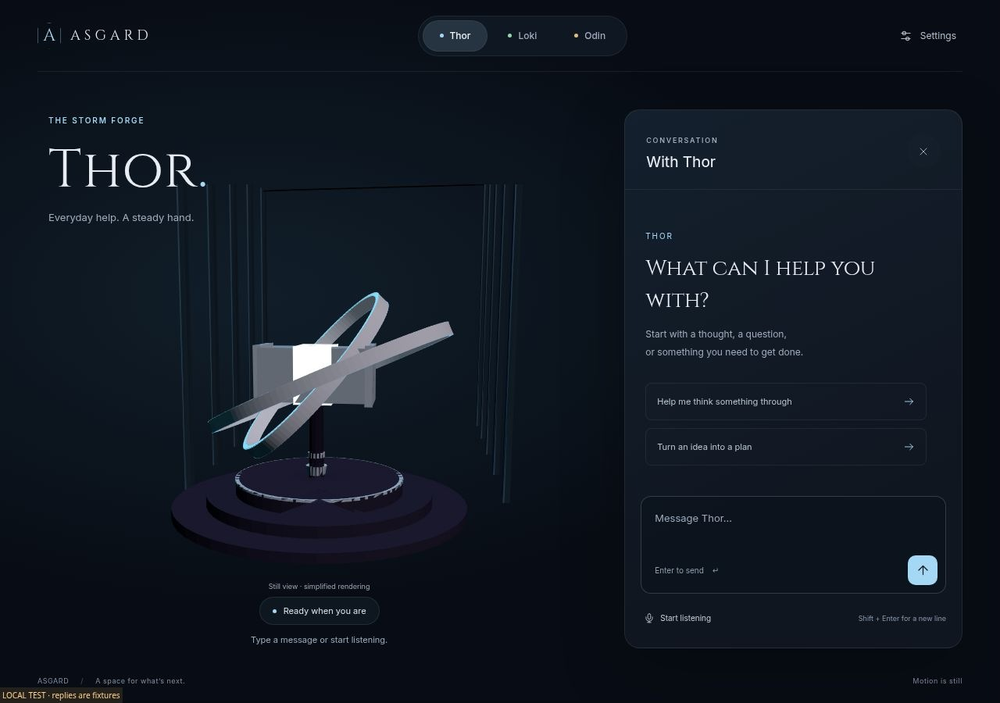
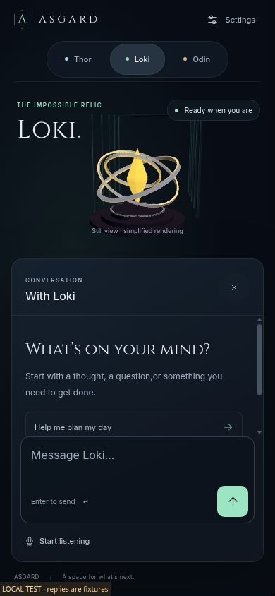

# ASGARD UI upgrade — final implementation report

## Outcome

The homepage has been replaced with a restrained, responsive assistant interface centered on the project's real Thor, Loki and Odin geometry. It has one conversation panel, clear state text, a small Settings surface and separately understandable voice controls. Existing backend routes, provider integrations, data and secondary pages were preserved.

This is a substantial implemented slice, ready for draft review. **The cloud browser could not initialize WebGL.** Therefore the GPU visual experience is implemented but not fully validated; the screenshot evidence shows the explicit simplified still renderer. No production deployment was performed.

## Visual improvements

The fixed illustrated desktop stage is now actual HTML layout around a rendered scene. Receding architectural ribs, a layered plinth, restrained persona colors, readable typography and controlled translucent surfaces establish a coherent space. Conversation remains beside the core on desktop and below it on phones.

Thor's focused ribbons are narrower and separated from the hammer. Loki retains the yellow crystal and emerald interface accent. Odin's focused iris uses inward-facing beveled blades; this was corrected after the initial browser inspection showed outward spokes. The models are authored development assets, with no user-facing modeling controls.

## Everyday usability

- The composer is readable and sendable by keyboard or button; number keys no longer switch persona during typing.
- Per-persona drafts survive switching and panel minimization within the page session.
- Replies support safe text, lists, code, links and bold emphasis. Pending, error and recovery states are explicit.
- Microphone input, spoken-output preference and interruption are separate controls. Source review corrected multiple overlap and hidden-page restart paths.
- Settings closes with Escape and restores focus. Its name remains accessible when only its icon is visible on narrow phones.
- Phone composition is redesigned rather than scaled down. In the checked 390 × 844 layout, both send and microphone controls fit in the initial view.

## Before and after

The [baseline desktop](evidence/before-desktop.jpg) used attractive but baked interface imagery. The [baseline phone](evidence/before-mobile.jpg) shrank that entire composition to a tiny strip. Compare the [new desktop](evidence/after-desktop.jpg), [new conversation](evidence/after-conversation.jpg), [Odin compact layout](evidence/after-tablet.jpg) and [320px phone](evidence/after-narrow.jpg).

Desktop baseline and final screenshots have different explicitly labeled widths, 1440px and 1280px. They demonstrate composition, not a pixel-diff test. Phone before/after share a 390 × 844 CSS viewport.

## Completed improvement count

The [ledger](IMPROVEMENT-LEDGER.md) records **10 implemented improvement areas**. Seven are verified within their documented browser/source-asset/test scope. Three—full WebGL presence, real voice behavior and host-level rendering lifecycle/performance—remain implemented but unverified in their target environment. Small cosmetic edits and document files were not inflated into additional features.

## Verification

- 10 focused state and real geometry tests passed.
- Local asset smoke checks, JavaScript syntax checks, mirrored HTML comparison and diff checks passed.
- Browser fixture checks exercised sending, pending state, failure/retry, draft preservation, persona switching, panel focus and settings.
- Layout inspection covered 1440, 1280, 1024, 390 and 320px widths. Final responsive DOM measurements found no horizontal overflow at the checked sizes.
- Live backend/provider tools were not called to create proof of success. Terminal HTTP smoke could not reach the browser preview; the explicit file-only smoke mode passed.

Full evidence, console context and limitations are in [VERIFICATION.md](VERIFICATION.md).

## Performance findings and limits

Balanced scheduling and DPR caps bound rendering work. Still/reduced-motion and hidden-page behavior avoid unnecessary continuous animation. Renderer files are locally pinned, and core resources are disposed on replacement. Quality-2 core geometry counts range from 3,040 to 4,272 triangles before host architecture; this is a CPU structural count, not an FPS claim.

No sustained physical-device performance measurement was possible. GPU visual fidelity, environment maps and mobile battery impact remain unverified. The simplified still projection is intentionally flatter than the desired GPU materials and does not establish photorealistic parity with the supplied concept art.

## Scope confirmation

No modeling bay, CAD/Blender controls, user model generation/import/export, new personas, tool catalog, financial system or unrelated backend capability was added. Existing code and authorization boundaries remain. Worker routing, bindings and migrations were preserved. Root and `public/` entrypoints remain mirrored.

## Known issues and prioritized follow-up

1. **GPU visual gate:** run the actual integrated page in a GPU-enabled browser on Rayan's Chromebook. Inspect all three models with conversation open/closed, Still/Balanced/High, pending/listening/speaking states, and material/floor ordering. Adjust only observed weaknesses.
2. **Voice/device gate:** test actual permission refusal, recognition network failure, wake switches, overlapping responses, stop-output, hidden tabs and microphone release; inspect iPhone keyboard behavior.
3. **Lifecycle/performance gate:** profile sustained rendering and context loss/recovery, and repeat host creation/disposal. Automatic context restoration is not implemented; the current fallback keeps chat usable.
4. **Optional resilience polish:** self-host font files if desired after preserving their licenses. Fonts already have system fallbacks; renderer code is local.

The next step is verification of this coherent interface, not adding tools or another design direction. See [HANDOFF.md](HANDOFF.md) for exact continuation steps.

## Delivery status

Rayan explicitly authorized pushing the prepared changes directly to `main`, superseding the earlier draft-PR plan. The latest remote `main` was `c9271f1a6df966ccc6a8015eace31e0c31f9aef2`; its only divergent commit removed four stale backups. Integrating that commit produced no file changes or conflicts, preserving all four removals.

**Comparison scope:** the UI implementation and verification described above are relative to ASGARD baseline `22fc1e85db1dec5d0e08eef7a5287b3cbaeaf34b`. Moving this result onto the older `main` also brings the existing ASGARD branch history, including backend and configuration changes made before this UI assignment. Those historical changes were not newly implemented or live-verified by this UI pass. No manual production deployment is included; any repository-connected deployment is outside this session's verified results.

The direct-main push is the authorized delivery operation. GPU and real-device verification remain outstanding regardless of successful delivery.
